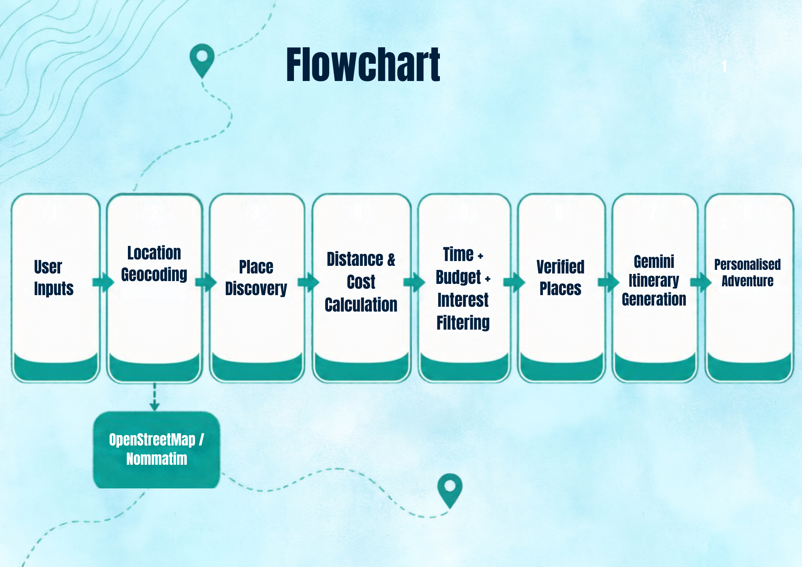
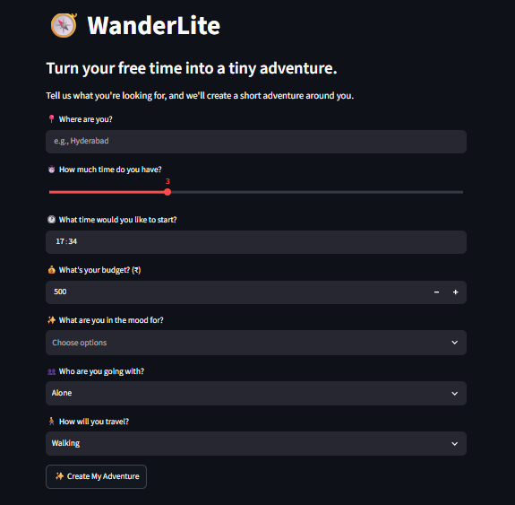
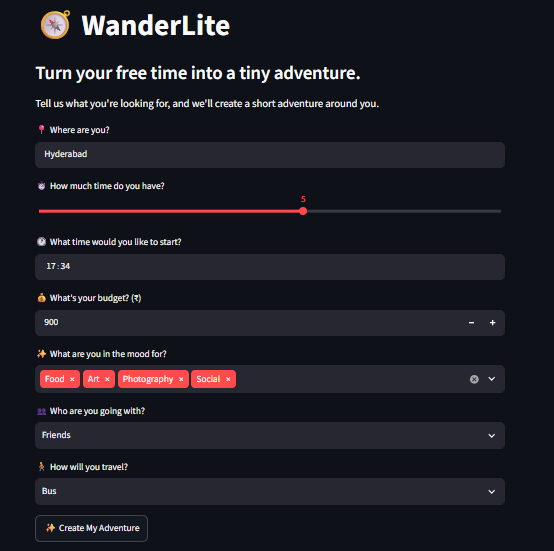
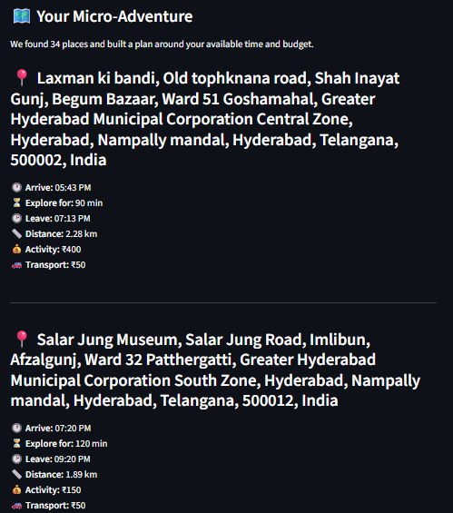
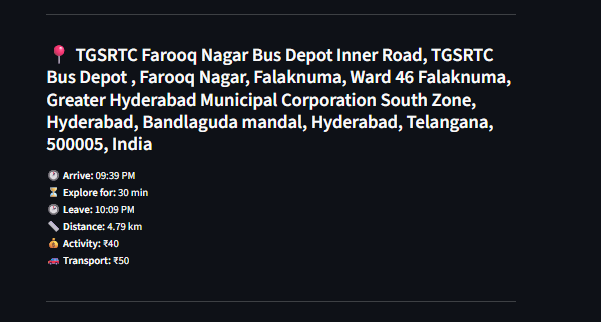
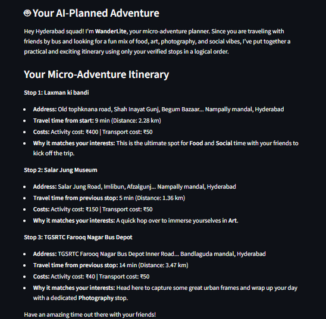
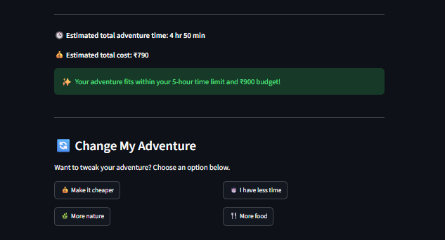

# 🧭 WanderLite – Micro-Adventure Planner

**Turn your free time into a tiny adventure.**

WanderLite is a personalised micro-adventure planner that helps users discover practical local experiences based on their **available time, budget, interests, company, and preferred mode of transport**. It combines location-based place discovery with personalised itinerary generation to create short and realistic adventure plans.

## 🚀 Live Demo

**[Try WanderLite](https://wanderlite-ai-micro-adventure-planner.streamlit.app/)**

## ✨ Features

* 📍 Location-based place discovery
* ⏱️ Planning based on available time
* 💰 Budget-aware adventure planning
* 🎯 Interest-based place matching
* 👥 Planning based on company, such as solo, friends, or family
* 🚶 Transport preference consideration
* 🗺️ OpenStreetMap-based location and place data
* ✨ Personalised itinerary generation using Gemini
* 📊 Estimated distance, travel time, and costs
* 🌱 Designed for short and spontaneous local adventures

## 🛠️ Tech Stack

**Programming Language**

* Python

**Interface**

* Streamlit

**APIs & Services**

* Google Gemini API
* OpenStreetMap / Nominatim

**Libraries**

* Requests
* Python-dotenv
* Google GenAI SDK

## 🔄 How It Works



### Workflow

1. **User Input**
   The user provides their location, interests, available time, budget, company, and preferred transport.

2. **Location Detection**
   WanderLite uses OpenStreetMap's Nominatim service to convert the starting location into geographical coordinates.

3. **Place Discovery**
   Relevant places are searched based on the user's selected interests and location.

4. **Filtering & Calculations**
   The application evaluates the discovered places using distance, estimated travel time, activity cost, and transport cost.

5. **Personalised Planning**
   The verified place information is provided to Gemini to generate a concise and personalised micro-adventure itinerary.

6. **Adventure Plan**
   The final plan is presented through the Streamlit interface.

## 📸 Screenshots

### Landing Page

### Planning Inputs

### AI Planned Adventure


### Complete Adventure Plan

### Plan Refinement


## 🔐 API Configuration

WanderLite uses the **Google Gemini API** to generate personalised adventure itineraries.

For local development, the Gemini API key is stored securely in a `.env` file using the `GEMINI_API_KEY` environment variable.

For the deployed Streamlit application, the API key is stored using **Streamlit Secrets** rather than being included in the source code or GitHub repository.

API keys and other sensitive credentials are intentionally excluded from version control using `.gitignore.

## 📁 Project Structure

```text
WanderLite/
│
├── app.py
├── places.py
├── llm.py
├── requirements.txt
├── .gitignore
├── README.md
│
└── screenshots/
    ├── home.png
    ├── recommendations.png
    ├── ai-itinerary.png
    └── complete-result.png
```
